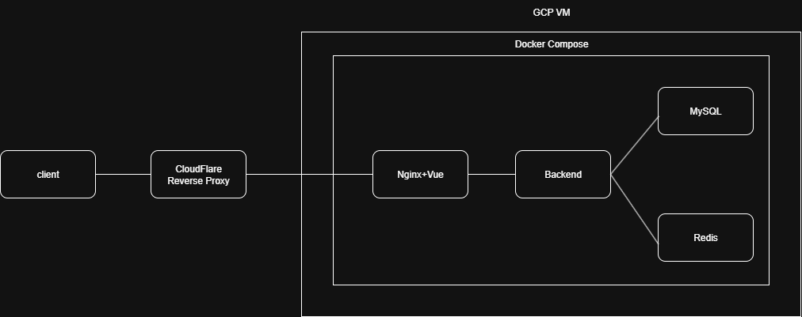

# 即時猜數字遊戲網站

https://game.my-hub.site/

## 簡介

這是一個多人「猜數字」遊戲的網站，支援房間管理、即時聊天室、帳號註冊登入、遊戲紀錄等功能。  
前端使用 Vue，後端為 Golang RESTful API 搭配 WebSocket，透過 Nginx 進行 HTTPS 加密與反向代理。所有服務皆使用 Docker Compose 管理，可用於快速部署至不同主機。

---

# 建構圖




---
## 技術架構

- **語言/框架**：Golang + Gin (RESTful API)
- **資料庫**：MySQL（持久化用戶、遊戲紀錄等資料）
- **快取/狀態管理**：Redis（儲存房間狀態、暫存遊戲資料）
- **即時通訊**：WebSocket（聊天室、遊戲即時互動）
- **前端**：Vue（Nginx 提供靜態檔案服務）
- **反向代理/靜態服務**：Nginx
- **容器化部署**：Docker Compose（MySQL、Redis、後端、前端、Nginx）
- **雲端平台**：Google Cloud Platform（GCP VM）
- **網域/SSL**：Cloudflare 免費憑證（HTTPS 加密）

---

## 系統設計

- **遊戲邏輯**：支援多人房間、回合制猜數字、勝負判斷。
- **資料持久化**：所有用戶、遊戲結果、歷史紀錄皆存於 MySQL。
- **房間狀態快取**：遊戲進行中狀態、玩家列表等即時資料存於 Redis，提升效能。
- **即時互動**：WebSocket 實現聊天室與遊戲事件推播，確保玩家體驗流暢。
- **安全性**：JWT 驗證、CORS 限制、HTTPS 加密。
- **可擴展性**：採用 Docker Compose，方便本地或雲端一鍵部署。

---

## 部署流程簡述

#### 部署相關文件說明

- `deploy/docker-compose.yaml`：主要的 Docker Compose 配置，協調 MySQL、Redis、後端、前端、Nginx 等服務。
- `deploy/nginx/nginx.conf`：Nginx 反向代理與靜態檔案服務設定，含 SSL 憑證路徑。
- `deploy/nginx/certs/`：SSL 憑證與私鑰存放目錄（Cloudflare 產生）。

#### 部署流程

1. **前後端編譯**
   ```sh
   npm run dev
   go build
   ```

2. **GCP VM 建立環境**  
   安裝 Docker、Docker Compose。

3. **撰寫 .env 設定**  
   設定 MySQL、Redis、APIServer 參數等。

4. **設定 nginx.conf**
   - 啟用 HTTPS 與 SSL 憑證 (CloudFlare免費憑證)
   - 前端靜態網頁部署
   - API 反向代理到 Golang Backend
   - 強制 HTTP 轉 HTTPS
   - 限制僅允許指定主機名

5. **啟動服務**  
   ```sh
   docker-compose up -d
   ```

6. **Cloudflare 設定**  
   - 將網域指向 GCP VM
   - 啟用 Cloudflare Porxy


